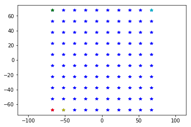

MEA definition
==============

This notebook shows how MEA can be using a .yaml file and how MEA models
can be added and removed to and from the file system.

.. code:: ipython3

    import MEAutility as MEA
    from pprint import pprint
    import matplotlib.pylab as plt

List available MEAs:
~~~~~~~~~~~~~~~~~~~~

.. code-block:: python

    MEA.return_mea()

.. parsed-literal::

    Available MEA: 
     ['SqMEA-6-25um', 'SqMEA-10-15um', 'tetrode', 'Neuroseeker-128', 'SqMEA-5-30um', 'SqMEA-15-10um', 'Neuronexus-32-Kampff', 'Neuronexus-32-cut-30', 'Neuropixels-128', 'Neuroseeker-128-Kampff', 'Neuropixels-24', 'SqMEA-7-20um', 'Neuronexus-32', 'Neuropixels-384']

These MEA are saved during installation. Each MEA corresponds to a .yaml
file containing key information for the MEA. Let's take a look at some
examples.

Square MEA
~~~~~~~~~~

.. code-block:: python

    sqmea_info = MEA.return_mea_info('SqMEA-10-15um')
    pprint(sqmea_info)

.. parsed-literal::

    {'dim': 10,
     'electrode_name': 'SqMEA-10-15um',
     'pitch': 15,
     'shape': 'square',
     'size': 5,
     'sortlist': None,
     'type': 'mea'}

The returned dictionary corresponds the the .yaml file. For this MEA
model ``dim`` is a single ``int`` and ``pitch`` is a single ``int`` (or
``float``). Therefore, a 10x10 Square MEA is instantiated with 15um
pitch in the yz direction (if ``plane`` is not in the yaml file, ``yz``
is default). The electrodes ``shape`` is ``square``, and half the side
length is 5um. Since ``sortlist`` is ``None``, the electrode count
starts from the bottom left and it follows the rows up and then goes to
the next column (the last index is the electrode on the top right). The
``type`` ``mea`` will be used for plotting.

Let's now instantiate a MEA object:

.. code-block:: python

    sqmea = MEA.return_mea('SqMEA-10-15um')
    print(type(sqmea))
    print(sqmea.number_electrodes)
    print(sqmea.dim)

.. parsed-literal::

    'plane' field with 2D dimensions assumed to be 'yz
    Model is set to semi
    <class 'MEAutility.core.RectMEA'>
    100
    [10, 10]

The MEA is a rectangular MEA with 100 electrodes.

.. code-block:: python

    plt.plot(sqmea.positions[:, 1], sqmea.positions[:, 2], 'b*')
    plt.plot(sqmea.positions[0, 1], sqmea.positions[0, 2], 'r*')
    plt.plot(sqmea.positions[9, 1], sqmea.positions[9, 2], 'g*')
    plt.plot(sqmea.positions[10, 1], sqmea.positions[10, 2], 'y*')
    plt.plot(sqmea.positions[-1, 1], sqmea.positions[-1, 2], 'c*')
    _ = plt.axis('equal')

Rectangular MEAs can be handled as matrices, where the first inex is the
ROW and the second index is the COLUMN:

.. code-block:: python

    print(sqmea[0][0].position) # electrode 0
    print(sqmea[9][0].position) # electrode 9
    print(sqmea[0][1].position) # electrode 10
    print(sqmea[-1][-1].position) # electrode 99

.. parsed-literal::

    [  0.  -67.5 -67.5]
    [  0.  -67.5  67.5]
    [  0.  -52.5 -67.5]
    [ 0.  67.5 67.5]

Rectangular MEA
~~~~~~~~~~~~~~~

.. code-block:: python

    neuroseeker_info = MEA.return_mea_info('Neuroseeker-128')
    pprint(neuroseeker_info)

.. parsed-literal::

    {'dim': [32, 4],
     'electrode_name': 'Neuroseeker-128',
     'pitch': 22.5,
     'shape': 'square',
     'size': 10.0,
     'sortlist': None,
     'type': 'mea'}

This MEA is rectangular, with 32 rows, 4 columns, and a regular pitch of
22.5um

.. code-block:: python

    neuroseeker = MEA.return_mea('Neuroseeker-128')
    print(type(neuroseeker))
    print(neuroseeker.number_electrodes)
    print(neuroseeker.dim)

.. parsed-literal::

    'plane' field with 2D dimensions assumed to be 'yz
    Model is set to semi
    <class 'MEAutility.core.RectMEA'>
    128
    [32, 4]

.. code-block:: python

    plt.plot(neuroseeker.positions[:, 1], neuroseeker.positions[:, 2], 'b*')
    _ = plt.axis('equal')
    print(neuroseeker[0][0].position) # electrode 0
    print(neuroseeker[31][0].position) # electrode 31
    print(neuroseeker[1][0].position) # electrode 32
    print(neuroseeker[-1][-1].position) # electrode 127

.. parsed-literal::

    [   0.    -33.75 -348.75]
    [  0.   -33.75 348.75]
    [   0.    -33.75 -326.25]
    [  0.    33.75 348.75]

General MEA
~~~~~~~~~~~

When ``dim`` and ``pitch`` is are single ``int`` (or ``float`` for
``pitch``) or a list of 2 values, a rectangular MEA is created. Some MEA
configuration can be different.

.. code-block:: python

    neuronexus_info = MEA.return_mea_info('Neuronexus-32')
    pprint(neuronexus_info)

.. parsed-literal::

    {'dim': [10, 12, 10],
     'electrode_name': 'Neuronexus-32',
     'pitch': [25.0, 18.0],
     'shape': 'circle',
     'size': 7.5,
     'sortlist': None,
     'stagger': -12.5,
     'type': 'mea'}

For this MEA there are 3 different options: - ``dim`` has 3 elements -
``pitch`` hass 2 elements - ``stagger`` is present

When len(\ ``dim``) > 2, then each element represents the number of rows
of each column. In this case, there are 3 columns: the first and third
have 10 electrodes, the second one has 12.

The first value of ``pitch`` is the inter-row distance (top to bottom).
The second value is the inter-column distance (left to right).

The ``stagger`` key allows the shift colimns. If only one value is given
(``int`` or ``float``) every other column starting from he second one is
staggered. Otherwise ``stagger`` can be a list with the same number of
elements of ``dim``.

Given this information, we can wxpect how the neuronexus MEA looks like:

.. code-block:: python

    neuronexus = MEA.return_mea('Neuronexus-32')
    plt.plot(neuronexus.positions[:, 1], neuronexus.positions[:, 2], 'b*')
    _ = plt.axis('equal')

.. parsed-literal::

    'plane' field with 2D dimensions assumed to be 'yz
    Model is set to semi

Adding and removing MEA models
------------------------------

It is possible to load user-defined yaml files in the MEAutility
package, so that they are available from the entire file system.

Let's first create a ``user.yaml`` file on-the-fly.

.. code-block:: python

    import yaml, os
    
    user_info = {'dim': [10, 12, 9, 8],
                 'electrode_name': 'user',
                 'description': "a brief description of the probe",
                 'pitch': [10.0, 40.0],
                 'shape': 'circle',
                 'size': 7.5,
                 'sortlist': None,
                 'stagger': [0, -12, 30, -22],
                 'type': 'mea'}
    
    with open('user.yaml', 'w') as f:
        yaml.dump(user_info, f)
        
    yaml_files = [f for f in os.listdir('.') if f.endswith('.yaml')]
    print(yaml_files)

.. parsed-literal::

    ['user.yaml']

Now we can add the newly created yaml file to the MEA package:

.. code-block:: python

    MEA.add_mea('user.yaml')

.. parsed-literal::

    Available MEA: 
     ['SqMEA-6-25um', 'SqMEA-10-15um', 'tetrode', 'Neuroseeker-128', 'SqMEA-5-30um', 'SqMEA-15-10um', 'Neuronexus-32-Kampff', 'Neuronexus-32-cut-30', 'Neuropixels-128', 'Neuroseeker-128-Kampff', 'Neuropixels-24', 'SqMEA-7-20um', 'Neuronexus-32', 'user', 'Neuropixels-384']

and create a ``user`` MEA object:

.. code-block:: python

    usermea = MEA.return_mea('user')
    plt.plot(usermea.positions[:, 1], usermea.positions[:, 2], 'b*')
    _ = plt.axis('equal')

.. parsed-literal::

    'plane' field with 2D dimensions assumed to be 'yz
    Model is set to semi

If we don't need the ``user`` MEA anymore, we can remove it from the MEA
package:

.. code-block:: python

    MEA.remove_mea('user')

.. parsed-literal::

    Removed:  /home/alessiob/anaconda3/envs/mearec/lib/python3.6/site-packages/MEAutility/electrodes/user.yaml
    Available MEA: 
     ['SqMEA-6-25um', 'SqMEA-10-15um', 'tetrode', 'Neuroseeker-128', 'SqMEA-5-30um', 'SqMEA-15-10um', 'Neuronexus-32-Kampff', 'Neuronexus-32-cut-30', 'Neuropixels-128', 'Neuroseeker-128-Kampff', 'Neuropixels-24', 'SqMEA-7-20um', 'Neuronexus-32', 'Neuropixels-384']

