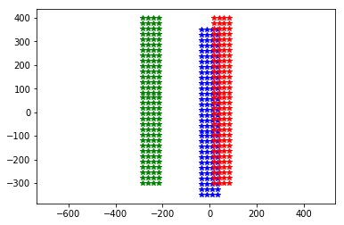
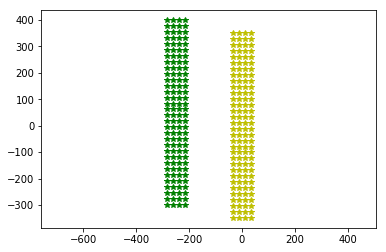
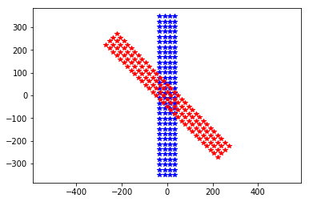
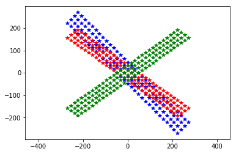

MEA handling
============

This notebook shows how to handle MEA and electrodes in he 3D space.

.. code-block:: python

    import MEAutility as MEA
    import matplotlib.pylab as plt

First, let's instantiate a MEA object among the available MEAs:

.. code-block:: python

    MEA.return_mea()

.. parsed-literal::

    Available MEA: 
     ['SqMEA-6-25um', 'SqMEA-10-15um', 'circle_500', 'tetrode', 'Neuroseeker-128', 'SqMEA-5-30um', 'SqMEA-15-10um', 'Neuronexus-32-Kampff', 'Neuronexus-32-cut-30', 'Neuropixels-128', 'Neuroseeker-128-Kampff', 'Neuropixels-24', 'SqMEA-7-20um', 'Neuronexus-32', 'Neuropixels-384']

.. code-block:: python

    neuroseeker = MEA.return_mea('Neuroseeker-128')
    plt.plot(neuroseeker.positions[:, 1], neuroseeker.positions[:, 2], 'b*')
    _ = plt.axis('equal')

.. parsed-literal::

    'plane' field with 2D dimensions assumed to be 'yz
    Model is set to semi

.. image:: mea_handling_files/mea_handling_5_1.png

By default the MEA is instantiated with it's center of mass at (0,0,0)
and electrodes lying in the plane specified in the yaml file (by default
``plane`` is ``yz``)

.. code-block:: python

    neuroseeker.plane

.. parsed-literal::

    'yz'

Moving the probe around
~~~~~~~~~~~~~~~~~~~~~~~

The probe can be easily moved with a the ``move`` and ``center``
methods:

.. code-block:: python

    plt.plot(neuroseeker.positions[:, 1], neuroseeker.positions[:, 2], 'b*')
    neuroseeker.move([0, 50, 50])
    plt.plot(neuroseeker.positions[:, 1], neuroseeker.positions[:, 2], 'r*')
    neuroseeker.move([0, -300, 0])
    plt.plot(neuroseeker.positions[:, 1], neuroseeker.positions[:, 2], 'g*')
    _ = plt.axis('equal')

.. code-block:: python

    plt.plot(neuroseeker.positions[:, 1], neuroseeker.positions[:, 2], 'g*')
    neuroseeker.center()
    plt.plot(neuroseeker.positions[:, 1], neuroseeker.positions[:, 2], 'y*')
    _ = plt.axis('equal')

Rotating the probe
~~~~~~~~~~~~~~~~~~

With the ``rotate`` method, MEA probes can be rotated along any axis by
any angle (in degrees). The current plane and orientation of the probe
is stored by the variables ``main_axes`` and ``normal``

.. code-block:: python

    # main_axes indicate the MEA plane
    print(neuroseeker.main_axes[0], neuroseeker.main_axes[1])
    
    # normal indicates the axis perpendicular to the electrodes
    print(neuroseeker.normal)
    
    # normal axis is also stored by each electrode and could be changed separately
    print(type(neuroseeker.electrodes[0]), neuroseeker.electrodes[0].normal)

.. parsed-literal::

    [0 1 0] [0 0 1]
    [-1.  0.  0.]
    <class 'MEAutility.core.Electrode'> [-1.  0.  0.]

Now le's make some rotations!!

.. code-block:: python

    plt.plot(neuroseeker.positions[:, 1], neuroseeker.positions[:, 2], 'b*')
    neuroseeker.rotate([1, 0, 0], 45)
    plt.plot(neuroseeker.positions[:, 1], neuroseeker.positions[:, 2], 'r*')
    _ = plt.axis('equal')

.. code-block:: python

    plt.plot(neuroseeker.positions[:, 1], neuroseeker.positions[:, 2], 'b*')
    neuroseeker.rotate([0, 1, 0], 45)
    plt.plot(neuroseeker.positions[:, 1], neuroseeker.positions[:, 2], 'r*')
    neuroseeker.rotate([0, 1, 0], 90)
    plt.plot(neuroseeker.positions[:, 1], neuroseeker.positions[:, 2], 'g*')
    _ = plt.axis('equal')

.. code-block:: python

    # back to normal
    neuroseeker.rotate([0, 1, 0], -90)
    neuroseeker.rotate([0, 1, 0], -45)
    neuroseeker.rotate([1, 0, 0], -45)
    plt.plot(neuroseeker.positions[:, 1], neuroseeker.positions[:, 2], 'b*')
    _ = plt.axis('equal')

.. image:: mea_handling_files/mea_handling_18_0.png

