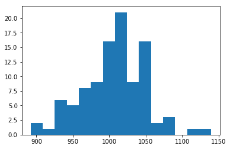
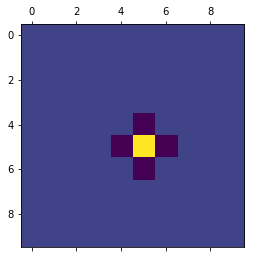
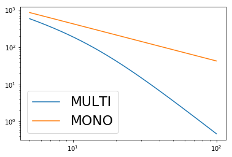
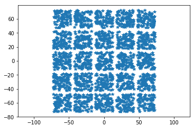
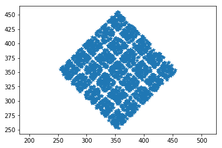
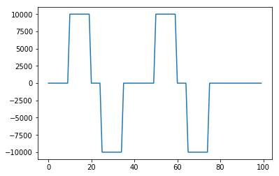
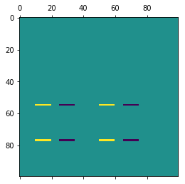
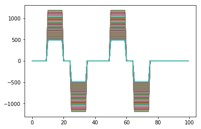

MEA stimulation
===============

This notebook shows how to simulate the electric potential generated by
electrode currents using a MEA object. Stimulation is performed by means
of currents. Voltage stimulation is not implemented as it strongly
depends on the electrode itself (e.g. faradaic/capacitive).

.. code-block:: python

    import MEAutility as MEA
    import matplotlib.pylab as plt
    import numpy as np

First, let's instantiate a MEA object among the available MEA models:

.. code-block:: python

    MEA.return_mea()

.. parsed-literal::

    Available MEA: 
     ['SqMEA-15-10um', 'SqMEA-6-25um', 'Neuronexus-32-cut-30', 'SqMEA-5-30um', 'Neuropixels-384', 'SqMEA-10-15um', 'Neuropixels-128', 'SqMEA-7-20um', 'Neuronexus-32-Kampff', 'Neuroseeker-128', 'tetrode', 'Neuropixels-24', 'Neuronexus-32', 'Neuroseeker-128-Kampff', 'tetrode_mea']

.. code-block:: python

    sqmea = MEA.return_mea('SqMEA-10-15um')

.. parsed-literal::

    'plane' field with 2D dimensions assumed to be 'yz
    Model is set to semi

By default, the stimulation ``model`` is set to ``semi``. This is the
default for MEA objects of type ``mea`` and it models that currents
radiate only on one side of the probe (the MEA is considered as an
infinite insulating plane). The underlying assumption is that ground is
infinitely far away. In this case the electric potential at point
:math:`\overrightarrow{r}` generated by the electrode currents
:math:`I_i` is (electrode positions are :math:`\overrightarrow{r_i}`):

.. math:: V(\overrightarrow{r}) = \sum_i \frac{I_i}{2\sigma\pi |\overrightarrow{r} - \overrightarrow{r_i}|}

where :math:`\sigma` is the tissue conductivity.

Instead, for mea type ``wire``, the tissue is assumed to be infinite and
homogeneous, that is the probe has no effect on the electric potential
and currents radiate in all directions:

.. math:: V(\overrightarrow{r}) = \sum_i \frac{I_i}{4\sigma\pi |\overrightarrow{r} - \overrightarrow{r_i}|}

Conventions
-----------

-  currents are in :math:`nA`
-  distances and positions are in :math:`\mu m`
-  electric potentials are in :math:`mV`

Handling currents
-----------------

MEA currents can be easily accessed and changed in various ways:

.. code-block:: python

    # check currents
    print(sqmea.currents)

.. parsed-literal::

    [0. 0. 0. 0. 0. 0. 0. 0. 0. 0. 0. 0. 0. 0. 0. 0. 0. 0. 0. 0. 0. 0. 0. 0.
     0. 0. 0. 0. 0. 0. 0. 0. 0. 0. 0. 0. 0. 0. 0. 0. 0. 0. 0. 0. 0. 0. 0. 0.
     0. 0. 0. 0. 0. 0. 0. 0. 0. 0. 0. 0. 0. 0. 0. 0. 0. 0. 0. 0. 0. 0. 0. 0.
     0. 0. 0. 0. 0. 0. 0. 0. 0. 0. 0. 0. 0. 0. 0. 0. 0. 0. 0. 0. 0. 0. 0. 0.
     0. 0. 0. 0.]

.. code-block:: python

    # set currents with an array 
    curr = np.arange(sqmea.number_electrodes)
    sqmea.currents = curr
    print(sqmea.currents)
    
    #set currents with a list
    curr = list(curr)
    sqmea.currents = curr
    print(sqmea.currents)

.. parsed-literal::

    [ 0.  1.  2.  3.  4.  5.  6.  7.  8.  9. 10. 11. 12. 13. 14. 15. 16. 17.
     18. 19. 20. 21. 22. 23. 24. 25. 26. 27. 28. 29. 30. 31. 32. 33. 34. 35.
     36. 37. 38. 39. 40. 41. 42. 43. 44. 45. 46. 47. 48. 49. 50. 51. 52. 53.
     54. 55. 56. 57. 58. 59. 60. 61. 62. 63. 64. 65. 66. 67. 68. 69. 70. 71.
     72. 73. 74. 75. 76. 77. 78. 79. 80. 81. 82. 83. 84. 85. 86. 87. 88. 89.
     90. 91. 92. 93. 94. 95. 96. 97. 98. 99.]
    [ 0.  1.  2.  3.  4.  5.  6.  7.  8.  9. 10. 11. 12. 13. 14. 15. 16. 17.
     18. 19. 20. 21. 22. 23. 24. 25. 26. 27. 28. 29. 30. 31. 32. 33. 34. 35.
     36. 37. 38. 39. 40. 41. 42. 43. 44. 45. 46. 47. 48. 49. 50. 51. 52. 53.
     54. 55. 56. 57. 58. 59. 60. 61. 62. 63. 64. 65. 66. 67. 68. 69. 70. 71.
     72. 73. 74. 75. 76. 77. 78. 79. 80. 81. 82. 83. 84. 85. 86. 87. 88. 89.
     90. 91. 92. 93. 94. 95. 96. 97. 98. 99.]

.. code-block:: python

    # reset currents to 0
    sqmea.reset_currents()
    print(sqmea.currents)
    
    # reset currents to 100
    sqmea.reset_currents(100)
    print(sqmea.currents)

.. parsed-literal::

    [0. 0. 0. 0. 0. 0. 0. 0. 0. 0. 0. 0. 0. 0. 0. 0. 0. 0. 0. 0. 0. 0. 0. 0.
     0. 0. 0. 0. 0. 0. 0. 0. 0. 0. 0. 0. 0. 0. 0. 0. 0. 0. 0. 0. 0. 0. 0. 0.
     0. 0. 0. 0. 0. 0. 0. 0. 0. 0. 0. 0. 0. 0. 0. 0. 0. 0. 0. 0. 0. 0. 0. 0.
     0. 0. 0. 0. 0. 0. 0. 0. 0. 0. 0. 0. 0. 0. 0. 0. 0. 0. 0. 0. 0. 0. 0. 0.
     0. 0. 0. 0.]
    [100. 100. 100. 100. 100. 100. 100. 100. 100. 100. 100. 100. 100. 100.
     100. 100. 100. 100. 100. 100. 100. 100. 100. 100. 100. 100. 100. 100.
     100. 100. 100. 100. 100. 100. 100. 100. 100. 100. 100. 100. 100. 100.
     100. 100. 100. 100. 100. 100. 100. 100. 100. 100. 100. 100. 100. 100.
     100. 100. 100. 100. 100. 100. 100. 100. 100. 100. 100. 100. 100. 100.
     100. 100. 100. 100. 100. 100. 100. 100. 100. 100. 100. 100. 100. 100.
     100. 100. 100. 100. 100. 100. 100. 100. 100. 100. 100. 100. 100. 100.
     100. 100.]

.. code-block:: python

    # random values with a certain amplitude and standard deviation
    sqmea.set_random_currents(mean=1000, sd=50)
    print(sqmea.currents)
    _ = plt.hist(sqmea.currents, bins=15)

.. parsed-literal::

    [ 973.91615691 1016.83720943 1089.49043841 1139.8579249   927.79316233
     1000.89661725 1047.3334144  1051.8497402   927.37268018  996.62983039
     1016.49251336 1043.75742297 1004.9168758   940.30748105 1054.53993841
      973.75422086  983.60405175 1042.34697708 1040.74580548 1014.98436691
     1001.8608754   995.65886874 1012.95710254  970.06809296  927.99036328
      999.92788465 1049.19541344  997.14646988 1039.79123706  984.20047048
      930.55017661 1009.74184644 1023.24453635 1018.02056444 1049.41097968
     1017.43562542 1062.60398159  973.51622737 1053.37464287  892.22969949
      999.73394752 1012.93137879  980.73150404  953.77253661  951.55426365
      905.11921863 1107.92750924  913.69396055 1077.18729127  962.6261477
     1043.49287399  952.72622053  993.51633173 1029.79201114 1014.65998008
      986.78997864 1007.9228314   973.1521672  1039.92862132  993.2816604
     1058.30275146  951.99364936 1047.30143561 1004.77930621 1010.1738069
      960.06196844  991.50504623  999.62108637 1037.74033168 1022.7296349
     1016.31311019 1020.75966681 1039.98604723  937.02190389 1050.16695834
     1041.47298494 1057.30344821 1022.87078261 1026.73934869 1049.05606228
     1010.57269555 1019.66052338  977.72552581 1043.29217666  988.32520744
     1003.95374263 1088.5345568   981.05722135  976.19800375 1037.08286147
     1026.14202785 1016.49830716 1012.46829058 1041.29563699 1010.75733243
     1005.74013272  958.06708739 1007.22074273  985.12744284  969.1025596 ]

For Rectangular MEAs, currents can be handled with matrices:

.. code-block:: python

    print(sqmea.get_current_matrix())
    print('Shape: ', sqmea.get_current_matrix().shape)

.. parsed-literal::

    [[ 973.91615691 1016.49251336 1001.8608754   930.55017661  999.73394752
      1043.49287399 1058.30275146 1016.31311019 1010.57269555 1026.14202785]
     [1016.83720943 1043.75742297  995.65886874 1009.74184644 1012.93137879
       952.72622053  951.99364936 1020.75966681 1019.66052338 1016.49830716]
     [1089.49043841 1004.9168758  1012.95710254 1023.24453635  980.73150404
       993.51633173 1047.30143561 1039.98604723  977.72552581 1012.46829058]
     [1139.8579249   940.30748105  970.06809296 1018.02056444  953.77253661
      1029.79201114 1004.77930621  937.02190389 1043.29217666 1041.29563699]
     [ 927.79316233 1054.53993841  927.99036328 1049.41097968  951.55426365
      1014.65998008 1010.1738069  1050.16695834  988.32520744 1010.75733243]
     [1000.89661725  973.75422086  999.92788465 1017.43562542  905.11921863
       986.78997864  960.06196844 1041.47298494 1003.95374263 1005.74013272]
     [1047.3334144   983.60405175 1049.19541344 1062.60398159 1107.92750924
      1007.9228314   991.50504623 1057.30344821 1088.5345568   958.06708739]
     [1051.8497402  1042.34697708  997.14646988  973.51622737  913.69396055
       973.1521672   999.62108637 1022.87078261  981.05722135 1007.22074273]
     [ 927.37268018 1040.74580548 1039.79123706 1053.37464287 1077.18729127
      1039.92862132 1037.74033168 1026.73934869  976.19800375  985.12744284]
     [ 996.62983039 1014.98436691  984.20047048  892.22969949  962.6261477
       993.2816604  1022.7296349  1049.05606228 1037.08286147  969.1025596 ]]
    Shape:  (10, 10)

.. code-block:: python

    current_of_zeros = np.zeros((10,10))
    print(current_of_zeros)

.. parsed-literal::

    [[0. 0. 0. 0. 0. 0. 0. 0. 0. 0.]
     [0. 0. 0. 0. 0. 0. 0. 0. 0. 0.]
     [0. 0. 0. 0. 0. 0. 0. 0. 0. 0.]
     [0. 0. 0. 0. 0. 0. 0. 0. 0. 0.]
     [0. 0. 0. 0. 0. 0. 0. 0. 0. 0.]
     [0. 0. 0. 0. 0. 0. 0. 0. 0. 0.]
     [0. 0. 0. 0. 0. 0. 0. 0. 0. 0.]
     [0. 0. 0. 0. 0. 0. 0. 0. 0. 0.]
     [0. 0. 0. 0. 0. 0. 0. 0. 0. 0.]
     [0. 0. 0. 0. 0. 0. 0. 0. 0. 0.]]

.. code-block:: python

    sqmea.set_current_matrix(current_of_zeros)
    sqmea.get_current_matrix()

.. parsed-literal::

    array([[0., 0., 0., 0., 0., 0., 0., 0., 0., 0.],
           [0., 0., 0., 0., 0., 0., 0., 0., 0., 0.],
           [0., 0., 0., 0., 0., 0., 0., 0., 0., 0.],
           [0., 0., 0., 0., 0., 0., 0., 0., 0., 0.],
           [0., 0., 0., 0., 0., 0., 0., 0., 0., 0.],
           [0., 0., 0., 0., 0., 0., 0., 0., 0., 0.],
           [0., 0., 0., 0., 0., 0., 0., 0., 0., 0.],
           [0., 0., 0., 0., 0., 0., 0., 0., 0., 0.],
           [0., 0., 0., 0., 0., 0., 0., 0., 0., 0.],
           [0., 0., 0., 0., 0., 0., 0., 0., 0., 0.]])

Single currents can be set separately either by:

.. code-block:: python

    # set elecectrode 50 current to 10000
    sqmea.set_current(24, 10000)
    sqmea.currents

.. parsed-literal::

    array([    0.,     0.,     0.,     0.,     0.,     0.,     0.,     0.,
               0.,     0.,     0.,     0.,     0.,     0.,     0.,     0.,
               0.,     0.,     0.,     0.,     0.,     0.,     0.,     0.,
           10000.,     0.,     0.,     0.,     0.,     0.,     0.,     0.,
               0.,     0.,     0.,     0.,     0.,     0.,     0.,     0.,
               0.,     0.,     0.,     0.,     0.,     0.,     0.,     0.,
               0.,     0.,     0.,     0.,     0.,     0.,     0.,     0.,
               0.,     0.,     0.,     0.,     0.,     0.,     0.,     0.,
               0.,     0.,     0.,     0.,     0.,     0.,     0.,     0.,
               0.,     0.,     0.,     0.,     0.,     0.,     0.,     0.,
               0.,     0.,     0.,     0.,     0.,     0.,     0.,     0.,
               0.,     0.,     0.,     0.,     0.,     0.,     0.,     0.,
               0.,     0.,     0.,     0.])

Or by using matrix notation for rectangular MEAs. This makes it easy,
for example, to create multipolar current sets.

.. code-block:: python

    # reset elecectrode 50 current to 0
    sqmea.set_current(24, 0)
    center_electrode = sqmea.dim[0]//2
    
    # build a multipolar current set
    sqmea[center_electrode][center_electrode].current = 8000
    sqmea[center_electrode+1][center_electrode].current = -2000
    sqmea[center_electrode-1][center_electrode].current = -2000
    sqmea[center_electrode][center_electrode+1].current = -2000
    sqmea[center_electrode][center_electrode-1].current = -2000
    
    _ = plt.matshow(sqmea.get_current_matrix())

Stimulation
-----------

Once currents are set, electric potentials can be computed with the
``compute field`` function. Let's first create a bunch of 3d points, for
example, on a straight line from close to the active electrode.

.. code-block:: python

    center_pos = sqmea[center_electrode][center_electrode].position
    print(center_pos)

.. parsed-literal::

    [0.  7.5 7.5]

.. code-block:: python

    npoints = 1000
    x_vec = np.linspace(5, 100, npoints)
    y_vec = [center_pos[1]] * npoints
    z_vec = [center_pos[2]] * npoints
    
    points = np.array([x_vec, y_vec, z_vec]).T
    # points should be a np.array (or list) o npoints x 3
    print(points.shape)
    print(points)

.. parsed-literal::

    (1000, 3)
    [[  5.           7.5          7.5       ]
     [  5.0950951    7.5          7.5       ]
     [  5.19019019   7.5          7.5       ]
     ...
     [ 99.80980981   7.5          7.5       ]
     [ 99.9049049    7.5          7.5       ]
     [100.           7.5          7.5       ]]

Now, we can compute the electric potential:

.. code-block:: python

    # multipolar currents
    Vp_multi = sqmea.compute_field(points)

and compare the field generated by a single electrode (monopolar current
source).

.. code-block:: python

    # monopolar currents
    sqmea.reset_currents()
    sqmea[5][5].current = 8000
    Vp_mono = sqmea.compute_field(points)

.. code-block:: python

    _ = plt.loglog(x_vec, Vp_multi, label='MULTI')
    _ = plt.loglog(x_vec, Vp_mono, label='MONO')
    _ = plt.legend(fontsize=22)

The potential fall for the multipolar is faster than the monopolar
configuration (which is linear in log scale)!

Finite electrode effect
-----------------------

So far, we assumed that the electrodes were point sources, but this is
of course not the case as they have a finite size. In some cases the
finite size of the electrode may be taken into consideration. In order
to do so, one can set the variable ``points_per_electrode`` of the MEA
object to the number of points within the electrode in which the entire
electrode current is split.

Let's take a look at an example:

.. code-block:: python

    sqmea_r = MEA.return_mea('SqMEA-5-30um')
    center_electrode = sqmea_r.dim[0] // 2
    
    # Activate all electrodes
    sqmea_r.set_random_currents(mean=0, sd=10000)
    reduced_points = points[:10]

.. parsed-literal::

    'plane' field with 2D dimensions assumed to be 'yz
    Model is set to semi

.. code-block:: python

    sqmea_r.points_per_electrode = 100
    
    # compute electric potential and return stimulation points
    vp, stim_points = sqmea_r.compute_field(reduced_points, return_stim_points=True)
    _  = plt.plot(stim_points[:, 1], stim_points[:, 2], '*')
    _ = plt.axis('equal')

The stimulation points are within the electrode ``square``. Stimulation
positions are consistent with after probe shifts and rotations:

.. code-block:: python

    sqmea_r.move([0,500,0])
    sqmea_r.rotate([1, 0, 0], 45)
    
    # compute electric potential and return stimulation points
    vp, stim_points = sqmea_r.compute_field(reduced_points, return_stim_points=True)
    _  = plt.plot(stim_points[:, 1], stim_points[:, 2], '*')
    _ = plt.axis('equal')

The effect of the electrode finite size on the electric potential in
proximity of the stimulation site is shown in the ``MEA_plotting``
section.

Temporal dynamics
-----------------

So far, we used *static* currents, but the effect of current dynamics
can be very important for exciting neurons. Temporal vatying currents
can be easily implemented with the MEAutility package.

Let's instantiate a new MEA object and set a monopolar biphasic source
with 2 pulses:

.. code-block:: python

    sqmea = MEA.return_mea('SqMEA-10-15um')
    center_electrode = sqmea.dim[0] // 2
    
    ntimes = 100
    bipolar_source = np.zeros(ntimes)
    bipolar_source[10:20] = 10000
    bipolar_source[25:35] = -10000
    bipolar_source[50:60] = 10000
    bipolar_source[65:75] = -10000
    
    _ = plt.plot(bipolar_source)

.. parsed-literal::

    'plane' field with 2D dimensions assumed to be 'yz
    Model is set to semi

.. code-block:: python

    # the current can be set directly accessing the electrode current
    sqmea[center_electrode][center_electrode].current = bipolar_source
    
    # OR
    
    # using set_current() (get_linear_id returns the index of the matrix in the linear array)
    sqmea.set_current(sqmea.get_linear_id(center_electrode+2, center_electrode+2), bipolar_source)

.. code-block:: python

    _ = plt.matshow(sqmea.currents)

Computing the electrical potential returns un array when currents have
temporal dynamics:

.. code-block:: python

    vp = sqmea.compute_field(points[:100])

.. code-block:: python

    print(vp.shape)
    _ = plt.plot(vp.T)

.. parsed-literal::

    (100, 100)

As expected the potential becomes lower moving further away from the
probe!
